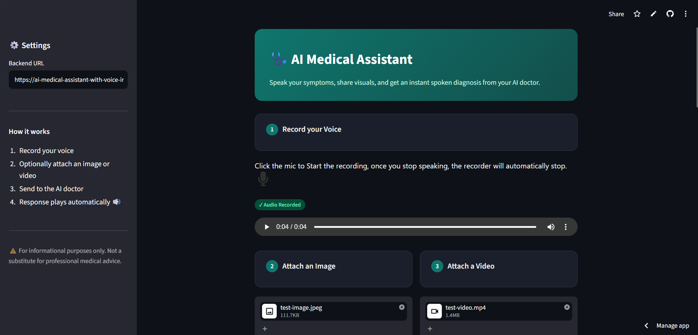
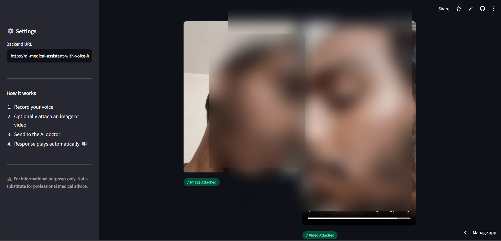
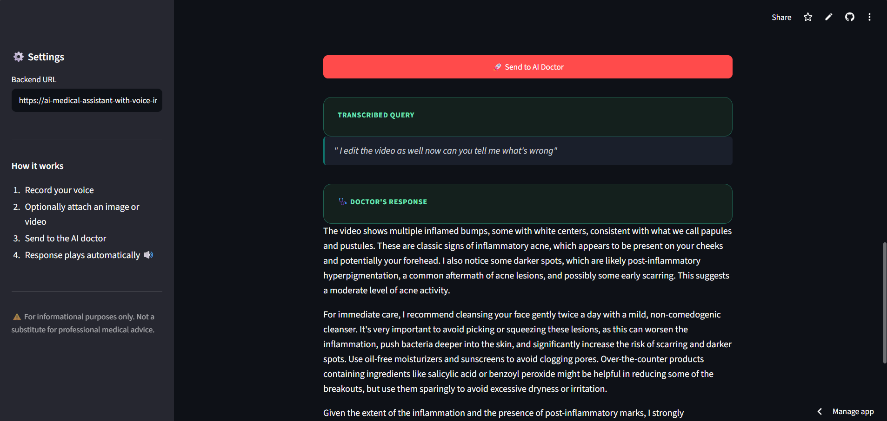

# 🩺 AI Skin Specialist

An AI-powered multimodal dermatology assistant that allows users to describe symptoms using their voice, upload images or videos of skin conditions, and receive a dermatologist-style assessment in both text and spoken audio.

The system combines Speech-to-Text, Computer Vision, Large Language Models, and Text-to-Speech to create a natural conversational healthcare experience.

---

## 🌐 Live Demo

https://aimedassistant.streamlit.app/

---

## 📸 Screenshots

### Home Interface

<p align="center">
  
</p>

---

### AI Diagnosis

<p align="center">
  
</p>

---

<p align="center">
  
</p>

---

## 🧠 Project Overview

AI Skin Specialist is a multimodal medical assistant focused on dermatology.

Users can:

- 🎙️ Record their symptoms using voice
- 🖼️ Upload skin images
- 🎥 Upload videos of affected areas
- 🤖 Receive an AI-generated dermatological assessment
- 🔊 Listen to the response through realistic speech synthesis

The system automatically:

1. Converts patient speech into text.
2. Analyzes uploaded visual content.
3. Generates a dermatologist-style response using Gemini.
4. Converts the response into natural speech.
5. Returns both text and audio to the user.

---

## 🚀 Problem Statement

Access to dermatological consultation can be limited due to:

- Geographic constraints
- Long appointment wait times
- High consultation costs
- Lack of immediate guidance

This project demonstrates how modern multimodal AI systems can assist users by providing preliminary dermatological insights while encouraging professional medical consultation.

> ⚠️ This project is intended for educational and informational purposes only and is not a substitute for professional medical advice, diagnosis, or treatment.

---

## 🔄 System Workflow

```text
Patient Voice
      │
      ▼
┌────────────────────┐
│ Speech-to-Text     │
│ Groq Whisper       │
└─────────┬──────────┘
          │
          ▼
 ┌──────────────────┐
 │ Patient Query    │
 └─────────┬────────┘
           │
           ▼
 ┌──────────────────────────┐
 │ Optional Image / Video   │
 └─────────┬────────────────┘
           │
           ▼
 ┌──────────────────────────┐
 │ Gemini 2.5 Flash         │
 │ Vision + Reasoning       │
 └─────────┬────────────────┘
           │
           ▼
 ┌──────────────────────────┐
 │ Dermatology Assessment   │
 └─────────┬────────────────┘
           │
           ▼
 ┌──────────────────────────┐
 │ Deepgram Aura            │
 │ Text-to-Speech           │
 └─────────┬────────────────┘
           │
           ▼
      Audio Response
```

---

## ⚙️ Architecture

```text
                    ┌──────────────────┐
                    │ Streamlit UI     │
                    └────────┬─────────┘
                             │
                             ▼
                    ┌──────────────────┐
                    │ FastAPI Backend  │
                    └────────┬─────────┘
                             │
         ┌───────────────────┼───────────────────┐
         │                   │                   │
         ▼                   ▼                   ▼

┌────────────────┐ ┌────────────────┐ ┌────────────────┐
│ Voice Input    │ │ Image Input    │ │ Video Input    │
└───────┬────────┘ └───────┬────────┘ └───────┬────────┘
        │                  │                  │
        ▼                  ▼                  ▼

┌─────────────────────────────────────────────┐
│      Gemini 2.5 Flash Multimodal LLM        │
└─────────────────────────────────────────────┘
                        │
                        ▼

┌─────────────────────────────────────────────┐
│     Dermatology Assessment Generation       │
└─────────────────────────────────────────────┘
                        │
                        ▼

┌─────────────────────────────────────────────┐
│      Deepgram Aura Text-to-Speech           │
└─────────────────────────────────────────────┘
                        │
                        ▼

              Spoken Medical Response
```

---

## ✨ Features

### 🎙️ Voice-Based Consultation

Users can describe symptoms naturally using speech.

### 🖼️ Image Analysis

Upload photos of skin conditions for visual assessment.

### 🎥 Video Analysis

Upload videos to provide additional context.

### 🤖 Multimodal AI Reasoning

Combines patient symptoms and visual information to generate contextual responses.

### 🔊 Audio Responses

Converts the doctor's response into natural speech using Deepgram.

### ⚡ FastAPI Backend

Scalable API architecture.

### 🎨 Streamlit Frontend

Clean and user-friendly interface.

### ☁️ Cloud Deployment

Supports deployment using Render and Streamlit Cloud.

---

## 🛠 Tech Stack

| Component | Technology |
|------------|------------|
| LLM | Gemini 2.5 Flash |
| Vision Processing | Gemini Vision |
| Speech-to-Text | Groq Whisper Large V3 Turbo |
| Text-to-Speech | Deepgram Aura 2 |
| Backend | FastAPI |
| Frontend | Streamlit |
| API Framework | FastAPI |
| Deployment | Render |
| Deployment | Streamlit Cloud |
| Configuration | YAML |
| Environment Variables | Python Dotenv |

---

## 📁 Project Structure

```text
AI-SKIN-SPECIALIST
│
├── src
│   │
│   ├── doctor
│   │   │
│   │   ├── components
│   │   │   ├── brain.py
│   │   │   ├── speech2text.py
│   │   │   └── text2speech.py
│   │   │
│   │   ├── logs
│   │   ├── samples
│   │   ├── utils
│   │   │
│   │   ├── config.py
│   │   ├── constants.py
│   │   ├── logger.py
│   │   ├── main.py
│   │   └── params.yaml
│   │
│   └── ui
│       ├── app.py
│       └── config.py
│
├── .gitignore
├── LICENSE
├── pyproject.toml
├── uv.lock
└── README.md
```

---

## 🔐 Environment Variables

Create a `.env` file inside:

```text
src/doctor/
```

```env
GOOGLE_API_KEY=your_google_api_key

GROQ_API_KEY=your_groq_api_key

DEEPGRAM_API_KEY=your_deepgram_api_key
```

---

## ⚡ Installation

### Clone Repository

```bash
git clone https://github.com/your-username/AI-Skin-Specialist.git

cd AI-Skin-Specialist
```

---

### Create Environment

```bash
uv sync
```

---

## ▶️ Run FastAPI Backend

```bash
cd src/doctor

uv run uvicorn main:app --reload
```

Backend:

```text
http://localhost:8000
```

Swagger Docs:

```text
http://localhost:8000/docs
```

---

## ▶️ Run Streamlit Frontend

```bash
cd src/ui

streamlit run app.py
```

Frontend:

```text
http://localhost:8501
```

---

## 📡 API Endpoint

### Analyze Patient Case

```http
POST /ask
```

Form Data:

| Field | Required | Type |
|---------|---------|---------|
| audio | ✅ | Audio File |
| image | ❌ | Image File |
| video | ❌ | Video File |

Response:

```json
{
  "transcription": "I have an itchy red rash on my arm.",
  "doctor_response": "This appears consistent with...",
  "audio_base64": "..."
}
```

---

## ⚙️ Configuration

Parameters can be modified inside:

```text
src/doctor/params.yaml
```

Example:

```yaml
gemini_model: "gemini-2.5-flash"
temperature: 0.1
transcription_model: "whisper-large-v3-turbo"
deepgram_model: "aura-2-thalia-en"
```

---

## ⚠️ Limitations

- Not a replacement for licensed medical professionals.
- AI assessments may be inaccurate.
- Medical image quality significantly impacts results.
- Does not provide prescriptions.
- Requires internet access and external AI APIs.

---

## 📚 Learning Outcomes

This project demonstrates:

- Multimodal AI Systems
- Vision-Language Models
- Medical AI Applications
- Speech-to-Text Pipelines
- Text-to-Speech Systems
- FastAPI Development
- Streamlit Applications
- API Integration
- Cloud Deployment
- AI Product Development

---

## 👨‍💻 Author

**Pratik Patil**

---

## 📄 License

This project is licensed under the MIT License.

---

## ⭐ Support

If you found this project useful, consider giving the repository a **Star ⭐**.